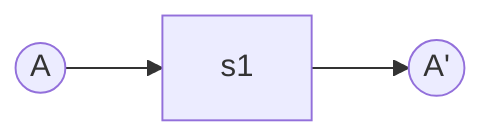
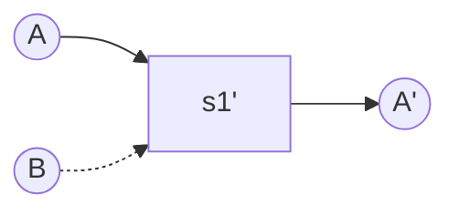
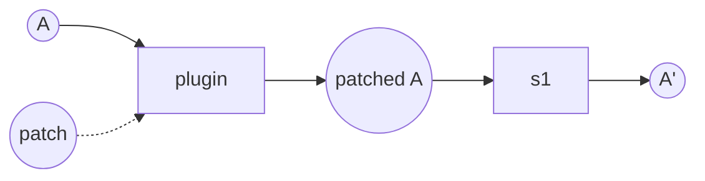
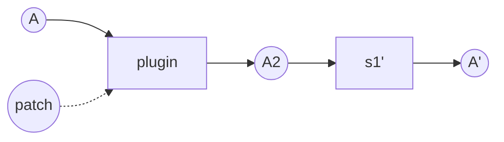

在整个程序都用数据流描述之后，对程序的修改都可以归结为对数据流的修改。
围绕一个例子来讲。

## 逻辑更新
直接替换或者插入数据流即可，和构建数据流的时候没有任何差别，举例来说：

## 数据更新
有趣的是，这和逻辑更新也是类似的，我们只需要用一条数据流把新的数据导入到数据集即可，导入完成后即可删除这条数据流。
包括 Structural Change 也可以用同样的手段来完成。

## 数据结构更新
如果要更新数据结构，则意味着对 Problem Domain 进行变更（从 A 变更到 A2），那么所有涉及到的数据流都应该失效并且等待更新，只有更新完所有的失效数据流之后才算是一次完整的更新。那么整个更新包含了两者。

1. 数据更新：引入 patch 数据流，迁移老数据到新的数据结构。
2. 数据流更新：对所有涉及到的数据流进行迁移。

