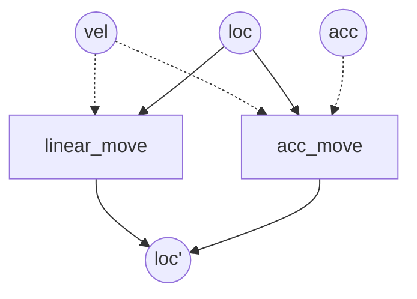

# 问题描述
> 当存在同一个 Stage 存在多个写的时候，会产生逻辑上的冲突，将数据流细分，直至每条数据流只有一个写可以解决这种冲突

# 方案解析
能做的就是消去重叠的部分。
举例来说，对于数据 A，有 A -> s1 -> A' -> s2 -> A''，但是如果一个 Stage 存在两个系统 A -> s1,s2 -> A'，则可能发生了冲突。这时的选择策略和函数重载一样，越特化，优先级越高。细化来说：
- 如果处于包含关系，则选择更小的集合。
- 如果处于交叉关系，重叠部分产生歧义。

对于歧义的处理，将进行去歧义化，将重叠部分无效化。
举例来说，对于查询 q(a, b)，q(a, b, c)，q(a, b, d) 有
- t(a, b, e) <- q(a, b)
- t(a, b, c, e) <- q(a, b, c)
- t(a, b, c, d) <- none //重叠部分无效化
# 算法
对应的算法很简单 - 枚举所有重叠的部分，将重叠的部分删掉，使得对象不可能匹配到多个查询：
```
query a;
foreach b confict with a:
	let s = merge(a.all, b.all)
	let e = substract(s, a.all)
	a.exlude.append(e)
```
# 代码用例
```cpp
//use ' to specify we write to stage 1
auto query = world.make("[inout]location', [in]velocity"_q);
//this algorithm write to location stage 1 too
auto query2 = world.make("[inout]location', [in]velocity, [in]acceleration"_q);
```
对应的 Data Flow

