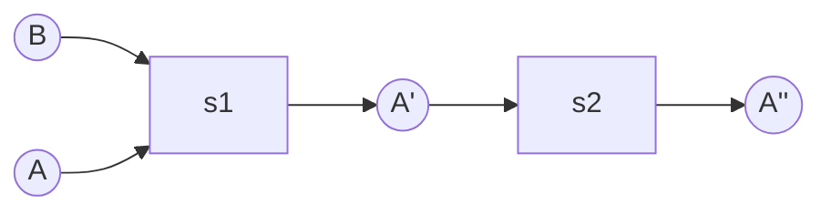
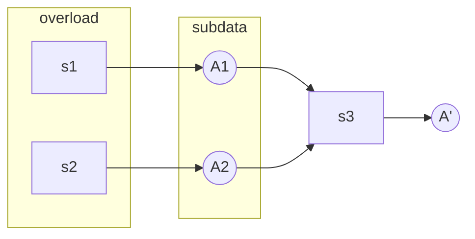
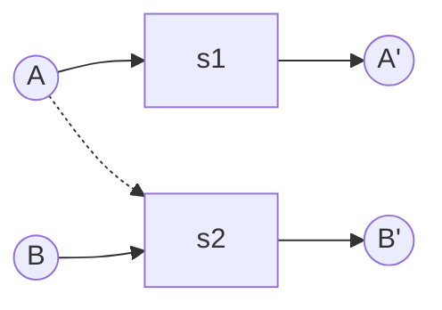
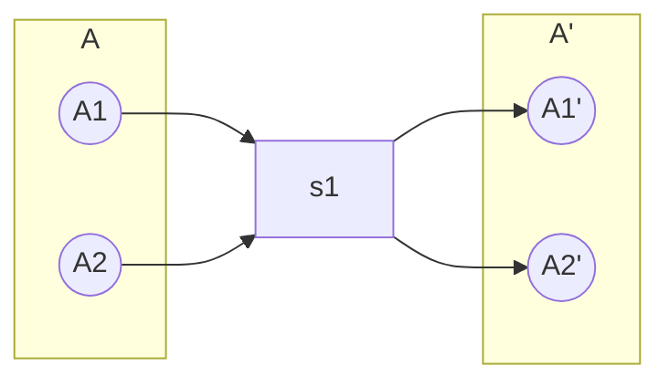
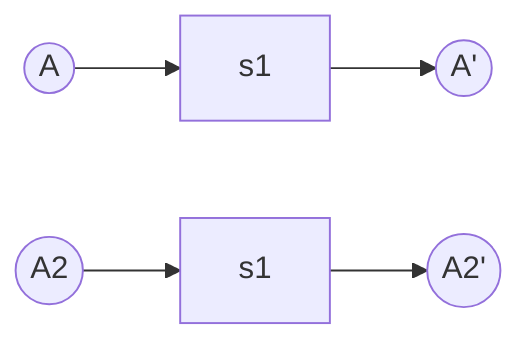

## The Graph
在 DOD 的概念中，程序就是由 Data Transfer 组成的，那么程序的整体结构就可以描述成一个 Data Flow，一个有向无环图。而我们可以对这个有向无环图进行分析或者可视化来帮助我们理解整个程序。
为了把这个抽象的有向无环图实例化出来，第一步就需要分析整个程序，当然这个不太现实，那么就需要人为的把关键信息标记出来。
## The Dots
把上面的概念映射到 ECS 的 System 上，也就是 System 需要标记自己的输入输出。
举例来说，假设有 System Move，`Location+=Velocity`：其输入为 Velocity，Location 输出为 Location。
但是这样提供的还不够完整：在 Component 流过一个 System 之后，它就是新的数据了。比如 Move 输出的 Location 实际是 "Moved Location"。在实际的开发中，你的逻辑也可能是对这种时序性相当敏感的。
那么为了补全这个信息，需要给 Component 附加一个 Stage 的信息，举例来说，对于 Component A：

可以看到，s1 和 s2 定义在 A 的不同 Stage 上。
当存在同一个 Stage 存在多个写的时候，会产生逻辑上的冲突，将数据流细分，直至每条数据流只有一个写可以解决这种冲突（即 [[Query Overload]]）。

然后多线程管理就可以通过分析构建好的这个有向无环图来解决：当然实际上会有各种各样的限制。
## Overload 并发
Overload 在 Archetype 架构下可以并发，但在 SparseArray 上不一定（因为可能出现 False Sharing）。
## The DSL
为了方便的在代码中描述以上关键信息，需要设计一套 DSL，我们期望 DSL 将系统的数据分组（筛选）和数据操作合在一起描述以简化复杂度，详情参考 [[Query]]
## The Aliasing
### Update
在上面的推论中，我们始终以函数式的角度在思考问题，所有变量都是不可变的，函数接受输入并输出新的数据。但出于性能考虑，我们实际的数据操作是 inplace 的，**也就是 A 和 A' 放在同一个内存地址上，也就是产生了 Aliasing，导致实际情况中并发被限制**，有如下例子：

在这个例子中 A 同时流向了 A' 和 B'，但是这个过程却因为 A 发生了读写冲突不能并发化。解决办法有几个：
- 分离 A' 和 A 的物理地址，惰性的合并。
- 放弃并发。
### Structural Change
在上面的讨论中一直隐含着一个假设，数据表的列是不变的，只有行会改变，这并不符合实际情况。当 Entity 的类型发生变动的时候，所有被涉及到的数据流动会因为 **Aliasing **问题（迭代器失效问题）产生冲突。而我们能做的有：
- 放弃并发。
- 分离物理地址，惰性的操作。
### Archetype
在 Archetype 的架构下，多了一个条件：不同 Archtype 中的相同 Component 物理地址并不同。所以又出现了几个选择：
- 保守的认为所有的数据都被影响，所有数据流等待冲突。（常见方案）
- 定位 Archetype，则以性能为代价精确整理数据流，被影响的数据流等待冲突。（可能得不偿失）
- 手动整理并发，在 Debug 模式下使用 Archetype 进行验证，以防出现错误。（比较激进，缺乏扩展性）

## The SubFlow
数据流的内部实际上为很多子数据流，这些子数据流也应该尽量的并行化。

- 1

- 2

## The Cache
现实中会有很多数据在 Database 之外：

- 为了性能考虑（一般是查询），我们会把数据组织成更复杂的结构，可能是临时的（比如 Grid），也可能是长久维护的（比如 CollisionWorld）。
- 在与外部模块交互的时候，会存在数据的交换。

这些数据也是属于数据流的。

- 临时数据的生命周期是可计算的。