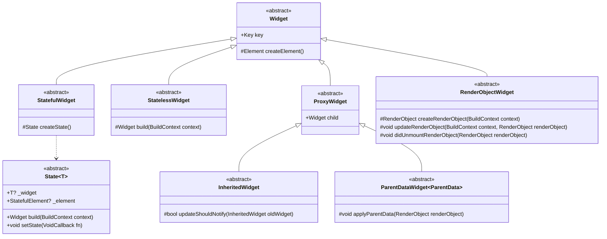
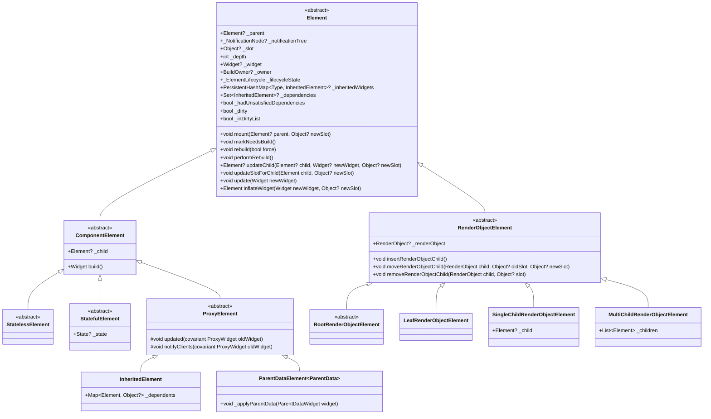
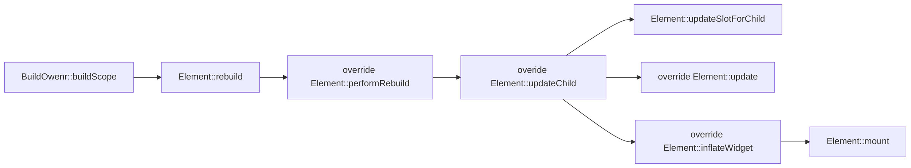
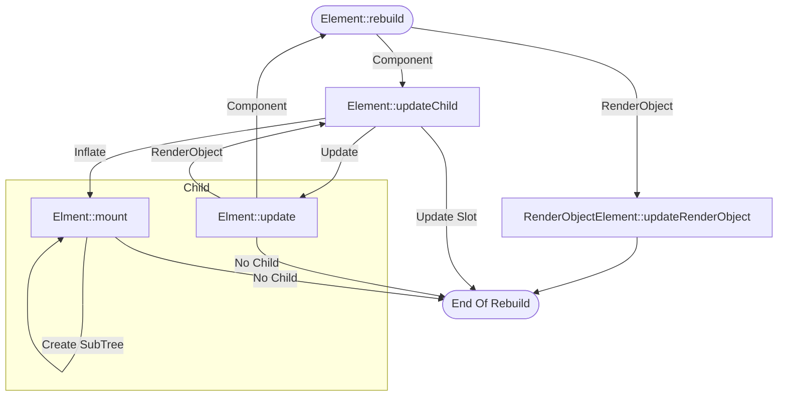
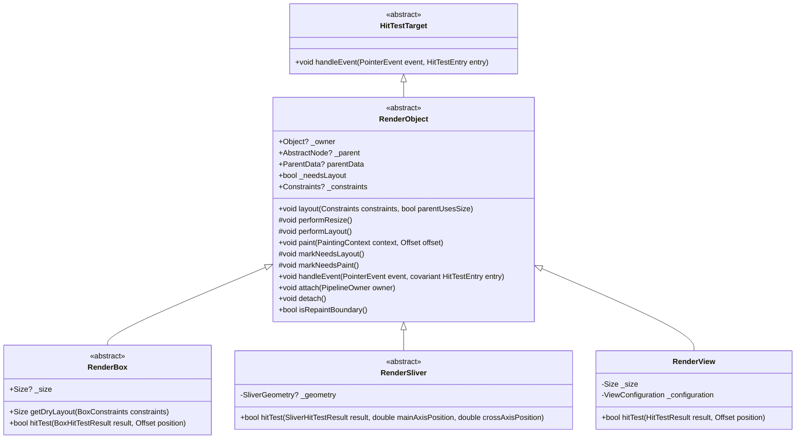
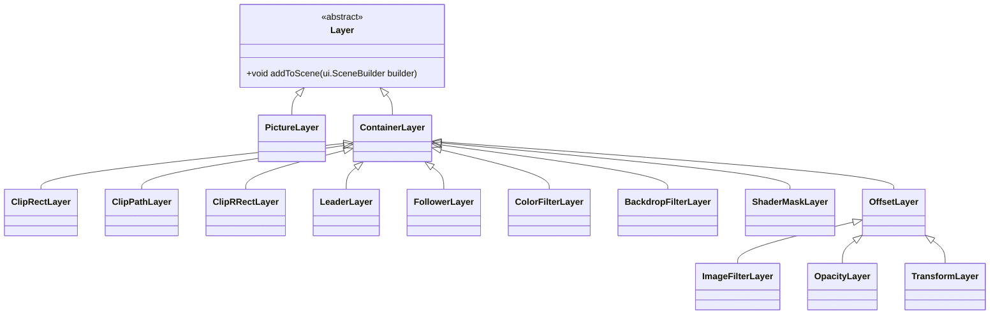

## 三颗树

`Element` 作为中间层控制 `Widget` 向 `RenderObject` 的映射，控制 Update 与 Inflate 的时机，`Element` 主要分为两大类，`ComponentElement` 与 `RenderObjectElment`，只有 `RenderObjectElement` 会被映射到 `RenderObject`，通常用到的控件映射关系如下表：

| 类型 |       Widget       |       Element       |    RenderObject     |                         说明                         |
|:----:|:------------------:|:-------------------:|:-------------------:|:----------------------------------------------------:|
| 组合 |  StatelessWidget   |  ComponentElement   |         N/A         |                 对控件进行单纯的拼装                 |
|      |   StatefulWidget   |  ComponentElement   |         N/A         |    持有一个 `State` 对象，是更新控件树的主要手段     |
| 代理 |    ProxyWidget     |  ComponentElement   |         N/A         |  用于传递数据或促进重绘，比如 `Flexible` 和 `Theme`  |
| 展示 | RenderObjectWidget | RenderObjectElement | 对应的 RenderObject | 参与渲染的 Widget，会由 Widget 直接创建 RenderObject |

### Widget

#### Widget 的分类
`Widget` 层直接由用户进行操作，是==信息最丰富==的一层，通常我们将 `Widget` 分类为：
- 组合型：`StatefulWidget` 和 `StatelessWidget`，用于组合 `Widget` 创造新的泛用类型
- 数据型：`InheritedWidget` 和 `ParentDataWidget`，用于向子 `Widget` 传递数据
	- `InheritedWidget` 致力于传播业务数据，比如 Theme，其子层从 Theme 中取东西的时候，都会取到最邻近父亲的 Theme，当持有其它业务数据要向子树传播时，也可也选择使用，这个控件会通过广播的形式传播自己数据更新的消息
	- `ParentDataWidget` 致力于传播渲染数据，主要是布局信息，比如 Flex 布局中，向下传播 Flexible
- RenderObject 型：`RenderObjectWidget`，参与渲染的 `Widget`，只有这部分 `Widget` 会被最终映射到 `RenderObject` Tree
#### Widget 的对象与数据映射
对象映射方面，通过 `Widget::createElement` 映射到 `Element`，`RenderObjectWidget::createRenderObject` 映射到 `RenderObject`

数据映射方面，`Element` 通过调用 `StatelessWidget:build` 与 `State<T>::build` 来实现控件树的向下增殖，调用 `RenderObjectWidget::updateRenderObject` 实现 `Widget` 参数向 `RenderObject` 转发，`ParentDataWidget<ParentData>::applyParentData` 实现 `ProxyWidget` 向 `RenderObject` 的信息转发

所有的调用时机由 `Element` 把握，而数据映射完全由于 `Widget` 把握，也就是说，`Element` 只是作为一个中间的隐藏层，提供调度与优化服务
### Element


#### Element 的分类
`Element` 的分类关系与 `Widget` 基本一致，但是将组合型与数据型的 `Widget` 合并到了一个基类 `ComponentElement`，即 `Element` 大致上分为两类：
- `ComponentElement`：不参与渲染，作为功能性对象存在，这类控件都只有一个 Child，并通过调用 `ComponentElement::build` 实现控件树的增殖
- `RenderObjectElement`：参与渲染的对象，简单的分为：
	- `Root`：根节点，但是在 OGUI 中并不需要这类对象，我们可能更需要 `Canvas` 对象
	- `Leaf`：无 Child 的叶子节点
	- `SingleChild`：单个 Child
	- `MultiChild`：多个 Child
#### Element 更新调用流

从 `BuildOwner` 中触发逻辑，走到 `performRebuild` 的时候，如果有 child，就会调用 `updateChild` 来更新，`updateChild` 根据变化的程度拆分了 3 种更新策略，并决定了是否向下传递更新。

子控件的保留和更新策略实现在 `performRebuild` 内，根据 `Element` 的分类进行不同的更新逻辑：
- 对于 `ComponentElement` 来说，就是直接调用 `build` 刷新子控件，并调用 `updateChild` 对 `child` 进行更新
- 对于 `RenderObjectElement` 来说，只是调用 `updateRenderObject` 向 `RenderObject` 刷新信息

`updateChild` 则是针对单个 child 进行分级更新：
- child 对象地址不变，则只更新 slot 信息
- child 对象类型与 key 一致，则只调用 child 的 `update`
- 不满足上述条件，则==移除整颗子树==，重新建立 `Element` 或者根据 `GlobalKey` 复用 `StatefulElement` 子树

`update` 函数中则实现了更新向子树的传递：
- `StatelessElement` 、`StatefulElement`、`ProxyElement` 均调用了 `rebuild` 函数来传递更新
- `RenderObjectElement` 调用 `updateRenderObject` 向 `RenderObject` 刷新信息，对 child 的更新实现在其子类中：
	- `SingleChildRenderObjectElement` 绕过了 `rebuild`，直接调用 `updateChild` 来传递更新
	- `MultiChildRenderObjectElement` 调用 `updateChildren`，根据 `key` 进行==单层==的 `Element` 复用

`inflateWidget` 生产一个新的 `Element`，并调用 `mount` 挂上 Element Tree，在 `mount` 中，如果有 child，则会向下传递更新
#### Element 的更新传递

更新传递有三种 case：
- `ComponentElement` 通过 `updateChild` -> `rebuild` -> `updateChild` -> `rebuild` 向子树传递更新
- 当遇到 `RenderObjectElement` 时，会绕过 `rebuild`，通过 `updateChild` 一路向下更新，直到再次遇见 `ComponentElement`
- 当遇到需要重建子树时，就会一路 `mount` -> `mount` -> `mount` 直到结束，或者遇到 `GlobalKey` 终止子树重建
#### Rebuild 与 Update 的语义
`rebuild` 发生在 `BuildOwner` 对标脏对象重构的场景，通过 `Element::markNeedsBuild` 触发，代表子树增殖与重建，只有 `ComponentElement` 具备子树增殖与重建的能力，所以 `RenderObjectElement` 在传递 `update` 时会绕过 `rebulid`，其中有个例外—— `SliverMultiBoxAdaptorElement` 由于其 child widget 通过回调创建，所以也存在 build 逻辑，会转为 `rebuild` 调用。

`update` 发生在 Parent 的 `updateChild` 中，代表 Parent 希望以新的 `Widget` 替换旧的 `Widget`，首先要明确这个函数是==由 Parent 触发的==，由于发生了改变，`update` 行为会不断的传递下去，这里主要与没有 build 逻辑的 `RenderObjectElement::rebuild` 进行对比，rebuild 触发时候==Widget 并没有发生更新==，所以对于没有 Build 逻辑的 `Element` 来说，就不会触发 `updateChild` 向下传递，同样的，如果==Widget 并未更新==，`updateChild` 也会阻断更新的向下传递。
### RenderObject

#### RenderObject 分类
- 绘制基元
	- 色块
	- 图
	- 文字
- 定位（Box）
	- 像素/百分比约束
	- 自适应
- 布局
	- 线性布局（Flex）
	- 流式布局（Wrap）
	- 叠加布局（Stack）
- ScrollView
	- ListView（需要支持不等高与无限滚动）
	- GridView（需要支持不等高与无限滚动）
- 效果
	- Effect
	- 装饰器（边框、圆角、阴影、形状、渐变、背景图像）
	- Mask（或许放在上者？）
	- BoxClipping
#### Flutter 实现对照表
##### 基本元素

|   Widget   |            Element             |    RenderObject    |                           Behaviour                            |
|:----------:|:------------------------------:|:------------------:|:--------------------------------------------------------------:|
|  RichText  | MultiChildRenderObjectElement  |  RenderParagraph   |                           绘制富文本                           |
|  RawImage  |    LeafRenderObjectElement     |    RenderImage     |                    绘制 Flutter 的图片对象                     |
| ColoredBox | SingleChildRenderObjectElement | \_RenderColoredBox |    绘制一个带颜色的 Box，可以带有一个 Child，不具备布局功能    |
|  Texture   |    LeafRenderObjectElement     |     TextureBox     | 绘制一个外部指定的 Texture 对象，用于渲染非 Flutter 托管的纹理 | 
##### 单控件布局
此处控件除了以下例外，`Element` 均为 `SingleChildRenderObjectElement`，故省略一列：
- OffStage：`_OffstageElement`

|         Widget          |            RenderObject            |                                  Behaviour                                  |
|:-----------------------:|:----------------------------------:|:---------------------------------------------------------------------------:|
|        SizedBox         |        RenderConstrainedBox        | 固定大小的 Box，如果宽高指定为 Inf 或 0，则会根据父亲约束的 Max 和 Min 赋值 |
|    SizedOverflowBox     |       RenderSizedOverflowBox       |          固定大小的 Box，但是允许其内容超出约束，并且可以指定对齐           |
|  FractionallySizedBox   | RenderFractionallySizedOverflowBox |                    以百分比形式指定 Box 大小，并附带对齐                    |
|       LimitedBox        |          RenderLimitedBox          |           当父亲的宽高为 Inf 时，使用指定的大小约束，否则则不约束           |
|     ConstrainedBox      |        RenderConstrainedBox        |                              持有一个 Box 约束                              |
|       OverflowBox       |    RenderConstrainedOverflowBox    |        持有一个 Box 约束，但是允许其内容超出约束，有一个 Align 属性         |
|       AspectRatio       |         RenderAspectRatio          |                              使约束固定高宽比                               |
|        FittedBox        |          RenderFittedBox           |                       自适应父亲约束，并可以接受 Clip                       |
|     IntrinsicHeight     |       RenderIntrinsicHeight        |                   将子控件调整到其内在高度，即自适应高度                    |
|     IntrinsicWidth      |        RenderIntrinsicWidth        |                   将子控件调整到其内在宽高，即自适应宽高                    | 
|          Align          |        RenderPositionedBox         |           控制控件如何摆放在父控件中，定位模式由于 Alignment 决定           |
|        Baseline         |           RenderBaseline           |             用来控制控件排版时的字符基线，在图文混排中特别有用              |
|         Padding         |           RenderPadding            |                              为子控件施加边距                               |
| ConstraintsTransformBox |   RenderConstraintsTransformBox    |                            自由调整子控件的约束                             |
|        Transform        |          RenderTransform           |                           应用一个 3D 的矩阵效果                            |
|        Offstage         |           RenderOffstage           |                             控制内容物显示与否                              |

OGUI 使用以下控件实现单控件布局：
- 尺寸指定：
	- SizedBox
	- LimitedBox
- 高宽比维护：
	- AspectRatio
	- FittedBox
- 自适应布局（需要优化概念）：
	- IntrinsicHeight
	- IntrinsicWidth
- 定位 & 约束：
	- Positioned（Rect 布局，兼顾 Padding 与约束指定）
	- ConstrainedBox
	- UnconstrainedBox
	- ConstraintsTransformBox
	- Baseline（文字基线排版）
- Misc
	- Transform
	- Offstage

自适应布局基于以下函数：
- computeDryLayout
- computeMinIntrinsicWidth
- computeMaxIntrinsicWidth
- computeMinIntrinsicHeight
- computeMaxIntrinsicHeight

##### 多控件布局
此处控件 `Element` 均为 `MultiChildRenderObjectElement`，故省略一列：

|    Widget    |    RenderObject    |                        Behaviour                        |
|:------------:|:------------------:|:-------------------------------------------------------:|
|     Flex     |     RenderFlex     |                        Flex 布局                        |
|    Stack     |    RenderStack     |                     Stack 层叠布局                      |
| IndexedStack | RenderIndexedStack |           Stack 层叠布局，但是一次只显示一层            |
|     Wrap     |     RenderWrap     |          再 MainAxis 上达到极限时候，自动换行           |
|   ListBody   |   RenderListBody   |              列表行为，但是没有 ScrollView              |
|     Flow     |     RenderFlow     | 通过回调自定义布局逻辑，通常用于对 Animation 的性能优化 | 
##### 滑动布局 & View

|      Widget      | Element | RenderObject | Behaviour |
|:----------------:|:-------:|:------------:|:---------:|
|     ListView     |         |              |           |
|     GridView     |         |              |           |
|    SliverGrid    |         |              |           |
|    SliverList    |         |              |           |
| CustomScrollView |         |              |           |
### Layout & Paint
`PipelineOwner::flushLayout` 执行 layout 刷新逻辑，`PipelineOwner::flushPaint` 执行 paint 拼装逻辑，在 layout 期间，`RenderSliver` 等控件可能需要中途载入新控件，这时，会使用 `RenderObject::invokeLayoutCallback` 来创建并附着控件。

## Layer & Composition


`Layer` 是隐藏在 `RenderObject` 下的第三棵树，在 `RenderObject::paint` 中被构建，并最终利用于绘制，主要用于实现：
- GeoCache：缓存部分节点的绘制几何
- Effect：一些全屏特效，比如模糊、局部透明、自定义效果
- Transform：提供在不调用 `RenderObject::paint` 刷新 GeoCache 的前提下，对控件树的某个部分进行 Transform 的选择
- Clip：应用 ClipRect
### Layer 拼装与更新复用
Layer 层作为最终递交的渲染数据，在 Flutter 中与 Skia 的概念相呼应，每个 Layer 都会对应一个 Embeded 的 EngineLayer，在 Paint 期间完成拼装，随后通过 `Layer::addToScene()` 函数提交到 Native 的 Scene 中，Layer 的持有者是 `RenderObject`，其生命周期跟随持有它的 `RenderObject` 与 ParentLayer，通过一个智能指针管理，在 `RenderObject::dispose()` 和从 ParentLayer 移除时 `--ref`，这一做法是为了尽可能推迟 Layer 的销毁时机，因为在 Flutter 中，Layer 的销毁代价是非常昂贵的

RenderObject 持有的通常是一个 ContainerLayer，通过 `RenderObject::updateCompositedLayer()` 来更新，而承载 Geometry 的 `PictureLayer` 会由 `PaintingContext` 主动生成并填入，当遇到 repaintBoundary 的时候，会马上生成一个 `ContainerLayer`，然后用这个 Context 去画 Child，所以 repaintBoundary 断开的 Layer 并不是 PictureLayer 的并排排列，而是 Picture-Container-Picture 的相间排列

更新时，会从 `PipelineOwner` 内被记脏的 `RenderObject` 开始构建，这里记录的 `RenderObject` 同都是持有 Layer 的，如果不持有 Layer，会向上找最近的，持有 Layer 的 `RenderObject` 标脏，在初始化的情形下，我们会对 RootRenderObject 手动赋予 Layer，来适配这种更新逻辑，由于 Layer 本身跟着 RenderObject 走，并且通常与 `isRepaintBoundary()` 强相关，所以控件的子树迁移在这里并不成问题

## Pixel 单位与 DPI
通过 `MediaQueryData::devicePixelRatio` 和 `MediaQueryData::textScaleFactor` 来实现映射
- `MediaQueryData::devicePixelRatio`：Device Px / Logic Px
- `MediaQueryData::textScaleFactor`：Device Text Px / Logic Px

默认值由 Window 提供，我们可以通过控件覆写这两个值来实现 DPI Scale

## 如何控制 Update 范围
flutter 提供了声明式的控件表达，而声明式的表达由于其本身的==无状态==，数据更新需要通过重新构建控件表达来实现，为了解决重新构建表达造成的==排版/绘制/合成==开销，flutter 设计了 Widget<-Element->RenderObject 的架构，**选择性**的让声明层的重构刷新到实际的控件层。

尽管解决了**排版/绘制/合成**的开销，表达层的 Widget 构建依旧是一笔可观的开销，为了控制 Update 的范围，flutter 提供了以下两种机制：
### State/StatefulWidget
State 被==持久化==存储在 Element 中，State 的更改会触发 StatefulElement 的 Rebuild 从而调用==State 的 Build==，将数据映射到控件，需要注意的是，如果在 `State::build()` 中建立了 StatefulWidget，一旦该 State 发生改变，其下的 StatefulWidget 由于 Element 的驱动作用==也会发生 Rebulid==，所以，如果想阻断更新，应该这么做：
```dart
class Test extends StatefulWidget {
	final Widget child;
	final Color  color;
	final Color  hoveredColor;
	State<Test> createState() => TestState();
}

class TestState extends State<Test> {
	bool hovered = false;
	Widget build(BuildContext context) {
		return MouseRegin (
			onEnter: (_) => { setState(() => { horvered = true }) },
			onExit: (_) => { setState(() => { horvered = false }) },
			child: Container(
				color: hovered ? widget.hoveredColor : widget.color,
				child: widget.child
			)
		)
	}
}
```

这样，当 State 数据发生更改时，由于 child 始终是同一个控件，更改作用域只有 `MouseRegion` 和 `Container` 两个控件。
### InheritedWidget/InheritedModel
通过向父控件（IheritedWidget）添加依赖的方式，在父控件发生数据变化时候，通知对应的子控件更新，InheritedWidget 提供粗粒度的通知，即任何控件值发生变化，都会导致==所有==依赖更新，InheritedModel 提供一种细化更新的方式，允许子控件依赖==单个值==的变化。

通常与 StatefulWidget 联用，实现更新阻断的同时完成局域更新：
```dart
class ThemeData extends InheritedWidget {
	final Color  color;
	final Color  hoveredColor;
}

class ThemedApp extends StatefulWidget {
	//...
	final Widget child;
	State<ThemedApp> createState() => ThemedAppState();
}
class ThemedAppState extends State<ThemedApp> {
	final Color  color;
	final Color  hoveredColor;
	
	Widget build(BuildContext context) {
		theme_child = ThemeData (
			color: color,
			hoveredCOlor: hoveredColor,
			child: widget.child
		);
		
		return {XXXWidgets}(
			child: theme_child
		);
	}
}
```

这样，当 state 的数据发生改变时，只有 ThemeData 发生了更新，从而促进依赖它的子控件更新
### StatelessWidget + InheritedWidget
InheritedWidget 的更新通知为 StatelessWidget 的刷新带来了可能，依赖的 InheritedWidget 的更新会触发 StatelessWidget 的 `build()`，从而实现局部刷新，需要注意的是，StatelessWidget==没有阻断更新的能力==，如果滥用会导致性能问题
### 状态管理框架
由于 State 通过控件维持在控件树上，如果**上层/平级**控件树需要知道同样的 State 会非常麻烦，这时候无非有以下选择：
1. 维护两个 State，并维护它们之间的数据同步，但是这==引入了新的复杂度==，且==数据同步容易出错==，==违背了单向数据流的初衷==
2. 将 State 控件上移，以保证所有控件的数据都来源于一个 State，但是这==导致更新范围扩大==，在大型项目中，最后会造成==所有的数据更改都要导致整个页面重新构建==的问题

这个问题可以通过 InheritedWidget 来缓解，通过==将数据封装如 InheritedWidget 并提高层级==，我们可以非常精准的控制刷新域，但是，这也引入了过多的样板代码，一组数据需要如下代码：
- 数据类
- InheritedWidget 封装
- StatefulWidget 封装
- State 封装

那么，我们能否通过框架实现其中 StatefulWidget、State、InheritedWidget 的封装，通过提供一个带通知回调的数据类，以及一个模板控件，直接实现这个功能呢。

于是 Flutter 提供了两种框架
- Porivder
- Riverpod

## 输入
### 总体结构
对 GUI 来说，输入事件分为 PointerInput（鼠标、触摸、笔）与 KeyInput（Keyboard、Gamepad）输入，对于一些特殊的轴向输入，通常可以被转化为 PointerInput 与 KeyInput 两种输入。

Flutter 将输入事件拆分成了两类——原始输入和手势输入，这也与其发展于移动端有很大的关系，原始事件是指直接由设备发出的事件，对于 Pointer 来说，通常有：
- Add/Remove/Move：主要针对触摸屏，即触点的增减于移动
- Down/Up/Hover：主要针对鼠标，按下，释放和移动
- Enter/Exit：主要针对带光标系统，不是设备事件，但也不是光标事件，由 MouseTracker 提供
- Zoom/Pan：主要针对触摸板，缩放和移动
- Scale/Scroll：由滚轮发出的缩放和滚动事件

关于 Move 和 Horver：
flutter 给出的定义是：
- Move：The pointer has moved with respect to the device while in contact with the device
- Hover：The pointer has moved with respect to the device while not in contact with the device

即，Move 是「按下」状态的，而 Hover 是「浮起」状态的，在触屏设备下，光标移动必须在 Add/Remove 或者是 Down/Up 的区间内，而在带指针的设备下，则没有这个限制。

对 Key 来说，状态就简单了很多，只分为：
- Down/Up：按下抬起
- Repeat：长按触发的反复输入

### PointerInput
#### 输入设备
- Stylus
- Trackpad
- Mouse
- Touch
#### 手势
手势通过  `GestureBinding` 处理，使用 `GestureRecognizer` 识别手势，提供了控件 `RawGestureDetector` 来配置的手势响应，提供了控件 `GestureDetector` 来监听和实现常见手势

对于支持复数个手势的控件产生的手势冲突，Flutter 提供了 `GestureArenaManager` 来实现手势的管理，遵循规则「第一个 accpect，或者最后一个没被 reject 的成员获胜」，
#### 事件触发流程
以经典的点击事件为例，在  `GestureBinding::_handlePointerEventImmediately` 中，先使用 `GestureBinding::hitTestInView` 进行射线检测，随后使用 `GestureBinding::dispatchEvent` 进行事件派发
#### HitTest
通过 Flutter 的根控件——RenderView，进行 hit test，一路向 `HitTestResult` 内添加 `HitTestEntry`，需要注意的是只有在 PointDown/PointHover 的时候会进行 HitTest，随后会记录住对应的 Path，在 PointUp/PointCancel 时复用，并进行 DIspatch

flutter 的 hit_test 并未在 RenderObject 层提供抽象，而是从 RenderBox/RenderSliver 开始提供，由于控件与控件之间的嵌套关系是确定的，这样的设计并没有什么问题：
- RenderBox，参数为 position（Offset）
- RenderSliver，参数为 main/cross axis 的 position
#### Dispatch
通过遍历 HitTest 返回的 Path 触发对应事件，在触发的过程中会收集手势信息，如 Click/Drag/Drop 等复合事件，是通过手势系统触发的，并不会便利 Path，而是由手势系统决定

## 焦点
通过 `FocusManager` 管理焦点，通过 `FocusNode` 与控件进行交流（对应控件 `Focus`），通过 `FocusScopeNode` 进行 Focus 流转的作用域控制（对应控件 `FocusScope`），焦点迁移的规则由 `FocusTraversalGroup/FocusTraversalPolicy` 提供

## Docking 与 Window
Window 代表系统窗口，作为 Host 持有 BuildOwner 与一颗完整的控件树，DockWindow 作为一个抽象概念，挂载到 DockArea 控件下，DockArea 按需调用 `DockWindow::build` 构建显示内容

## GDI
GDI device 存储于 PipelineOwner，在 `RenderObject::attach` 时获取并执行对应初始化，`RenderObject::detach` 

## Reference
- [从架构到源码：一文了解Flutter渲染机制 - 知乎 (zhihu.com)](https://zhuanlan.zhihu.com/p/183770848)
- [Flutter中三棵树的理解 - 掘金 (juejin.cn)](https://juejin.cn/post/7044783155051495438#heading-1)
- [Flutter框架分析（二）-- Widget - 知乎 (zhihu.com)](https://zhuanlan.zhihu.com/p/368016029)
- [Flutter | 深入浅出Key - 掘金 (juejin.cn)](https://juejin.cn/post/6844903811870359559)
- [说说Flutter中的Semantics - 掘金 (juejin.cn)](https://juejin.cn/post/6844904039495237639)
- [Introduction - Flutter Internals (megathink.com)](https://flutter.megathink.com/v/chinese/)
- [ListView class - widgets library - Dart API (flutter.dev)](https://api.flutter.dev/flutter/widgets/ListView-class.html)
- [Flutter 必知必会系列 —— 从 SchedulerBinding 中看 Flutter 帧调度 - 掘金 (juejin.cn)](https://juejin.cn/post/7114950118947684382)
- [[Flutter] ProxyWidget 和 Element 更新的正确姿势 - 掘金 (juejin. cn)]( https://juejin.cn/post/7127612090050674724 )
- [Flutter框架分析- Parent Data - 知乎 (zhihu.com)](https://zhuanlan.zhihu.com/p/374473051)
- [Flutter 9种布局组件（带详细案例） - 掘金 (juejin.cn)](https://juejin.cn/post/6919653632468221966)
- [Flutter ListView详解 - 掘金 (juejin.cn)](https://juejin.cn/post/6844903715531407374)
- [Flutter 绘制探索 5 | 深入分析重绘范围 RepaintBoundary | 七日打卡 - 掘金 (juejin.cn)](https://juejin.cn/post/6917786452247986190)
- [Performance best practices | Flutter](https://docs.flutter.dev/perf/best-practices)
- [Flutter 组件 | 手牵手，一起走 CompositedTransformFollower 与 CompositedTransformTarget - 掘金 (juejin.cn)](https://juejin.cn/post/6946416845537116190)
- [Layout widgets | Flutter](https://docs.flutter.dev/ui/widgets/layout)
- [详解px,dp,pt,sp,ppi,dpi及屏幕适配 - 知乎 (zhihu.com)](https://zhuanlan.zhihu.com/p/267325087)
- [万字长文！一文搞懂 Flutter 局部刷新机制 - 知乎 (zhihu.com)](https://zhuanlan.zhihu.com/p/429641624)
- [Flutter 必知必会系列 —— 从 GestureBinding 中看 Flutter 手势处理过程 - 掘金 (juejin.cn)](https://juejin.cn/post/7103773537470676999)
- [Flutter FocusNode 焦点那点事-(一) - 掘金 (juejin.cn)](https://juejin.cn/post/6854573216015499271)
- [Flutter FocusNode 焦点那点事-(二) - 掘金 (juejin.cn)](https://juejin.cn/post/6854573216216645646)
- [Flutter完整开发实战详解(十五、全面理解State与Provider) - 掘金 (juejin.cn)](https://juejin.cn/post/6844903866706706439)
- [Flutter | 状态管理指南篇——Provider - 掘金 (juejin.cn)](https://juejin.cn/post/6844903864852807694)
- [Flutter Riverpod 全面深入解析，为什么官方推荐它？ - 掘金 (juejin.cn)](https://juejin.cn/post/7063111063427874847)