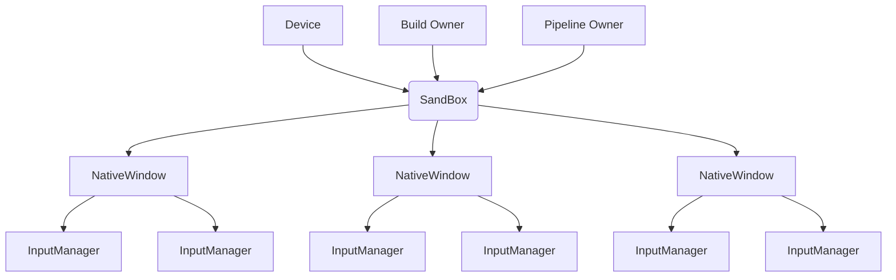

## 分层模型
![[架构分层模型.png|800]]
- **Backend**：提供对系统的控制、查询功能，负责==对外==控制和信息提供
- **CoreFramework**：控件框架，提供必要的框架性功能，确定控件书写的基本逻辑
- **CoreSystem**：半外挂（外挂 framework）式系统，提供输入与窗口管理，通过插入对应的控件影响 Widget

## 重要系统从属 & 结构

==InputManager 与 FocusManager 可以合并==