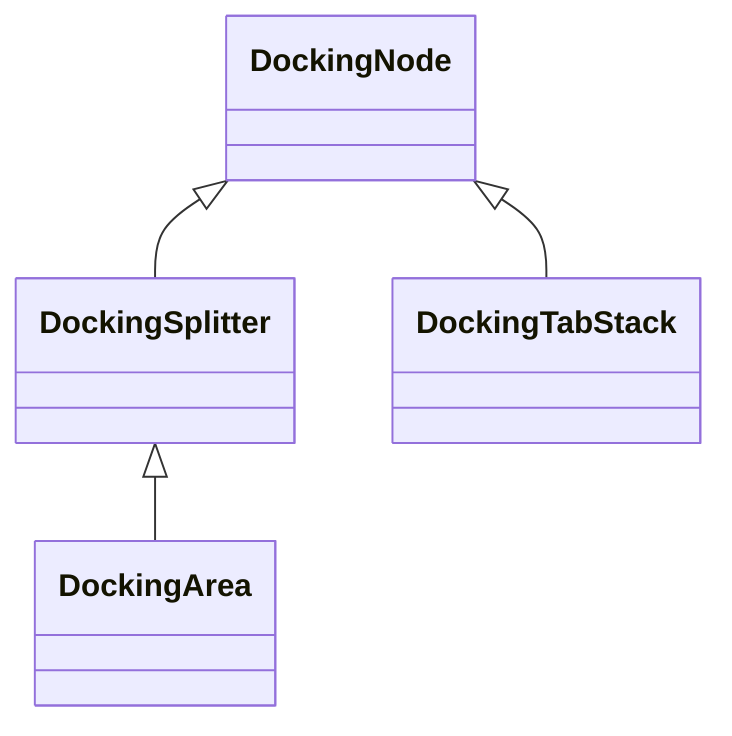

## 表层抽象
对 Window 系统的表层抽象，只需要关注 Popup & Tooltip 就够了，更复杂的窗口，应该让用户在有感知的状态下进行，在初期，甚至 Popup 与 Tooltip 的抽象都没必要存在。

头疼的是，Window 管理与 IWindow/IDevice 的概念发生了冲突，应当考虑，将 IWIndow/IDevice 作为纯粹的 UI 工作环境接口（Desktop/Texture/VirutalRect），窗口则由 WindowManager 操作，CoreFramework 一般不直接访问 IWindow/IDevice 这一层

## Docking
### 类型结构

